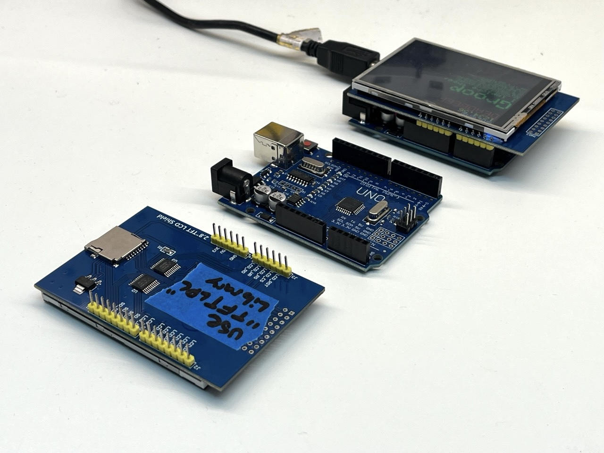

# How to

Following this worked for me:
[https://learn.adafruit.com/2-8-tft-touch-shield/lcd-test](https://learn.adafruit.com/2-8-tft-touch-shield/lcd-test)

Specifically: 
- Installing the TFTLCD library and the GFX library.
- then open in the Arduino IDE under File -> Examples -> Adafruit TFTLCD Library -> graphicstest

Using "TFTLCD" was important

The thing I got wrong initially was that:
I tried using the ILI9341 Library which is the wrong one for these specific screens.

